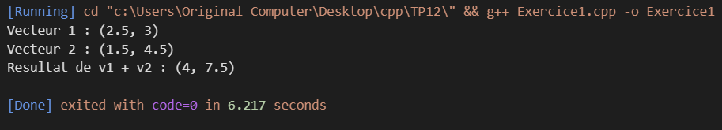
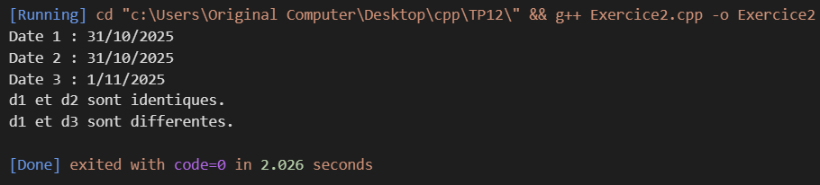
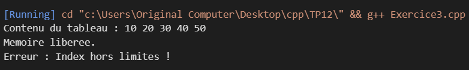
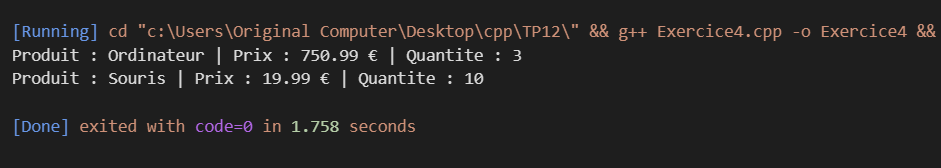

**📘 TP 12 : Surcharge d'opérateurs**

**🎯 Objectif général**

Ce projet regroupe plusieurs exercices simples en C++ pour comprendre la surcharge d’opérateurs, un concept fondamental de la programmation orientée objet

TP12/
│
├── exercice1.cpp
├── exercice2.cpp
├── exercice3.cpp
├── exercice4.cpp
├── README.md
└── images/
    ├── exercice1.png
    ├── exercice2.png
    ├── exercice3.png
    └── exercice4.png

**🧮 Exercice 1 — Surcharge de l’opérateur + : Classe Vecteur2D**

**Objectif : Additionner deux vecteurs à 2 dimensions.**

**Principes utilisés :**

Constructeur avec paramètres
Surcharge de l’opérateur +
Méthode afficher()

**💻 Exemple d’exécution :**

**📅 Exercice 2 — Surcharge des opérateurs == et != : Classe Date**

**Objectif : Comparer deux dates.**

**Principes utilisés :**

Comparaison d’objets
Réutilisation de == dans !=
Constructeurs par défaut et paramétrés

**💻 Exemple d’exécution :**

**🧱 Exercice 3 — Surcharge de l’opérateur [] pour accéder aux éléments d’un tableau dynamique : Classe Tableau**

**Objectif : Simuler un tableau dynamique avec contrôle des bornes.**

**Principes utilisés :**

Allocation dynamique (new / delete[])
Gestion d’exceptions avec std::out_of_range
Retour par référence dans operator[]

**💻 Exemple d’exécution :**

**🛒 Exercice 4 — Surcharge de l’opérateur << : Classe Produit**

**Objectif : Personnaliser l’affichage d’un objet avec cout.**

**Principes utilisés :**

Fonction amie friend
Retour d’un flux ostream&
Affichage formaté

**💻 Exemple d’exécution :**

